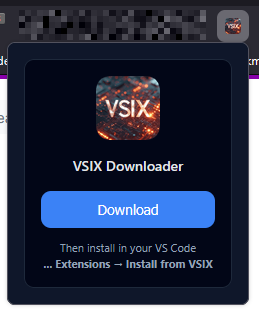
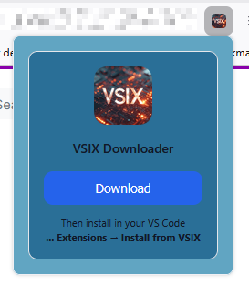
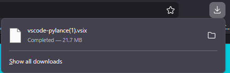
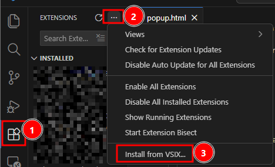

# Vsix-Getter-Chrome-Extension

    

This Firefox extension allows you to **download VSCode extensions** in `.vsix` format directly from the Visual Studio Marketplace. You can easily retrieve extensions without going through the traditional installation process.

---

## Installation

- Now directly available on firefox addons : 
    - https://addons.mozilla.org/en-GB/firefox/addon/vsix-downloader/?utm_source=addons.mozilla.org&utm_medium=referral&utm_content=search

---

## Display Modes: Dark and Light 🎨

This extension supports both **Dark** and **Light** modes. Screenshots:

     &nbsp;&nbsp; 

---

## Downloading a .vsix file ✅

1. Go to the **Marketplace page** of the VSCode extension you want to download (e.g., [VS Python](https://marketplace.visualstudio.com/items?itemName=ms-python.python)).

    

2. **Click the "Download the extension"** button in the extension popup to start the download.

3. The `.vsix` file will be saved to your default downloads folder.

---

## Installing the `.vsix` in VSCode 🔧

To install a downloaded `.vsix` in Visual Studio Code:

1. Open VSCode.
2. Go to the **Extensions** view (left sidebar).
3. Click the `...` menu at the top of the Extensions view and choose **Install from VSIX...**.
4. Select the downloaded `.vsix` file and confirm the installation.

    

---

## CLI Tools 

- **You prefer CLI Tools to get more in once ? **  
You can also download VSCode extensions directly from the Marketplace page using the [VSIX Getter CLI](https://github.com/LGD-P/Vsix-Getter-CLI.git).

